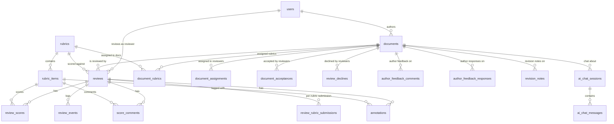

# Database

The backend is a single **Supabase Postgres** database. The web app and the
Chrome extension are both clients of it. All access from the browser uses the
**anon key**, so **Row Level Security (RLS) is the real authorization boundary.**

---

## Schema / ERD

Core hub tables: **`users`**, **`documents`**, **`rubrics`**, and **`reviews`**
(the join of a reviewer + a document + a rubric). Scores, comments, and
annotations hang off `reviews` and `rubric_items`; a separate author-feedback
loop and an AI-chat feature add their own tables.



### Key tables

| Table | Purpose | Notable columns / FKs |
| --- | --- | --- |
| `users` | Identity + profile (mirrors `auth.users`) | `email`, `display_name`, `role` (enum), `roles text[]`, `institution`, `expertise_tags text[]`, `onboarding_completed`, `rubric_specializations text[]` |
| `documents` | An OER submission under review | `author_id → users`, `title`, `authors`, `subject_matter`, `file_type` (enum), `file_url`, `storage_path`, `creative_commons_license` (enum), `coordinator_upload`, `coordinator_released_at`, `is_draft`, `pages jsonb`, `platform`, `source_url`, `content_fingerprint`, `submission_scope text[]` |
| `rubrics` | A review rubric | `title`, `description`, `operational_definition`, `is_preset` |
| `rubric_items` | Criteria in a rubric | `rubric_id → rubrics`, `label`, `description`, `sort_order` |
| `document_rubrics` | Join: rubrics applied to a document | `document_id → documents`, `rubric_id → rubrics` |
| `reviews` | One reviewer's review of one document with one rubric | `document_id → documents`, `reviewer_id → users`, `rubric_id → rubrics`, `status` (enum), `general_comment`, `overall_comment`, `last_saved_at`, `submitted_at` |
| `review_scores` | Per-criterion scores | `review_id → reviews`, `rubric_item_id → rubric_items`, `score` / `criterion_scores[]` (enum), `comment` |
| `review_rubric_submissions` | Marks a rubric submitted within a review | `review_id → reviews`, `rubric_id → rubrics`, `submitted_at` |
| `score_comments` | Comments attached to a criterion score level | `review_id → reviews`, `rubric_item_id → rubric_items`, `body`, `score_level` |
| `annotations` | Anchored highlights/notes on the document | `review_id → reviews`, `rubric_item_id → rubric_items` (nullable), `anchor jsonb`, `body`, `tag` |
| `review_events` | Activity / telemetry log | `review_id → reviews`, `reviewer_id`, `event_type`, `session_id`, `data jsonb`, `occurred_at` |
| `document_assignments` | Coordinator assigns a document to a reviewer | `document_id → documents`, `reviewer_id → users`, `assigned_by → users`, `declined_at`, `decline_note` |
| `document_acceptances` | Reviewer accepts an assignment | `document_id → documents`, `reviewer_id → users` |
| `review_declines` | Reviewer declines a document | `document_id → documents`, `reviewer_id → users`, `note` |
| `author_feedback_comments` | Author's comments on a feedback target | `document_id`, `review_id`, `author_id`, `target_type` (enum), `target_id`, `body` |
| `author_feedback_responses` | Author's response status on a target | `document_id`, `review_id`, `author_id`, `target_type` (enum), `target_id`, `status` (enum) |
| `revision_notes` | Author revision notes for a document | `document_id`, `review_id` (nullable), `author_id`, `body` |
| `ai_chat_sessions` | An AI-assistant chat session | `document_id`, `review_id` (nullable), `user_id`, `role`, `rubric_name` |
| `ai_chat_messages` | Messages within a chat session | `session_id → ai_chat_sessions`, `role`, `content`, `shortcut_type` |
| `ai_chat_events` | AI-chat telemetry | `document_id`, message/session refs, event data |
| `institutions` | Standalone lookup | `name` |

### Enums

| Enum | Values |
| --- | --- |
| `user_role` | `reviewer`, `author`, `admin` |
| `review_status` | `unassigned`, `assigned`, `in_progress`, `submitted` |
| `criterion_score` | `does_not_meet`, `exemplifies`, `exceeds` |
| `file_type` | `pdf`, `html`, `image`, `audio`, `pptx` |
| `anchor_type` | `text-range`, `dom-range`, `bbox`, `timestamp` |
| `feedback_target_type` | `annotation`, `score_comment`, `general_comment`, `overall_comment`, `criterion` |
| `feedback_response_status` | `addressed`, `will_address_later` |
| `creative_commons_license` | `cc_by`, `cc_by_sa`, `cc_by_nd`, `cc_by_nc`, `cc_by_nc_sa`, `cc_by_nc_nd` |
| `expert_domain` | 17 discipline values (`agriculture` … `other`) |

> Note: `user_role` (the enum column `users.role`) does **not** include
> `coordinator`; the coordinator role is carried in the `users.roles text[]`
> array, which is what `proxy.ts` checks for role-based dashboard routing.

### Functions

- `current_user_role() → user_role` — reads the caller's role; used inside RLS
  policies.
- `review_has_submission(...)`, `rubric_submitted_for_review(...)` — submission
  guards.
- `update_torus_document_pages(...)` — RPC the extension calls to persist Torus
  page metadata.

---

## RLS policy overview

**RLS is the authorization layer.** The web app and the extension both connect
with the anon key, so every table that holds user data must have RLS enabled and
policies that scope rows to the authenticated user (`auth.uid()`) and/or their
role.

The pattern used across the schema:

- **Ownership scoping** — a row is visible/writable only to the user it belongs
  to, e.g. `auth.uid() = user_id` (or `= reviewer_id` / `= author_id`).
- **Parent-ownership scoping** — child rows (scores, comments, annotations,
  messages) are gated by an `EXISTS` subquery up to the owning parent row.
- **Role-based scoping** — coordinators/admins get broader access via the
  `current_user_role()` helper.

The one policy set committed to the repo is for the AI-chat feature
(`features/ai-chat/supabase/migrations/20260706_ai_chat_history.sql`) and
illustrates the ownership + parent-ownership pattern:

```sql
alter table ai_chat_sessions enable row level security;
alter table ai_chat_messages enable row level security;

create policy "Users can manage their own chat sessions"
  on ai_chat_sessions for all
  using (auth.uid() = user_id)
  with check (auth.uid() = user_id);

create policy "Users can manage messages in their own sessions"
  on ai_chat_messages for all
  using (exists (
    select 1 from ai_chat_sessions s
    where s.id = ai_chat_messages.session_id and s.user_id = auth.uid()
  ))
  with check (exists (
    select 1 from ai_chat_sessions s
    where s.id = ai_chat_messages.session_id and s.user_id = auth.uid()
  ));
```

> ⚠️ The RLS policies for the **core** tables (`documents`, `reviews`,
> `review_scores`, `annotations`, …) live only in the Supabase project, **not in
> the repo**. There is no migrations directory capturing them (the top-level
> `schema.sql` is an empty 0-byte placeholder). Treat the live Supabase
> dashboard as the source of truth and export policies before making changes.
> Run `get_advisors` (Supabase) periodically to catch tables with RLS disabled.

---

## `types/database.types.ts` is auto-generated — never hand-edit it

`types/database.types.ts` is produced by the **Supabase CLI** type generator
(recognizable by the `__InternalSupabase.PostgrestVersion` block and the
`Tables` / `TablesInsert` / `TablesUpdate` / `Enums` / `Constants` generics).

- **Do not hand-edit it.** Any manual change is lost the next time types are
  regenerated. Change the schema in Supabase, then regenerate (see below).
- The typed clients (`lib/supabase/client.ts`, `server.ts`) import `Database`
  from `@/types/database.types`, so the whole query layer is only as correct as
  this file is current.
- `lib/supabase/types.ts` is **not** a competing schema — it now just
  `export type { Database } from '@/types/database.types'` and adds hand-written
  domain types (anchor shapes like `TextRangeAnchor`, `BboxAnchor`, …). Import
  the `Database` type from `@/types/database.types`.

---

## Migration process

There is **no top-level migration workflow** — no `supabase/` directory, no
`config.toml`, no `seed.sql`, and no db scripts in `package.json`. Schema changes
are applied **manually via the Supabase dashboard / SQL editor**, then types are
regenerated. The only committed migration
(`features/ai-chat/supabase/migrations/20260706_ai_chat_history.sql`) documents
this convention in its own header comment.

The de-facto process:

1. Write the DDL (tables, columns, indexes, **and RLS policies**).
2. Apply it in the Supabase **SQL editor** (or via the Supabase MCP
   `apply_migration` — a Supabase MCP server is configured in `.mcp.json`).
   Prefer a Supabase **branch** for anything risky, then merge.
3. Regenerate the TypeScript types:
   ```bash
   npx supabase gen types typescript --project-id <project-id> > types/database.types.ts
   ```
4. Commit the DDL alongside the regenerated types so the change is reviewable,
   even though the running database was migrated out-of-band.

> **Recommended improvement:** adopt a real top-level `supabase/migrations/`
> directory and the Supabase CLI so schema (including RLS) is version-controlled
> rather than living only in the hosted project.
